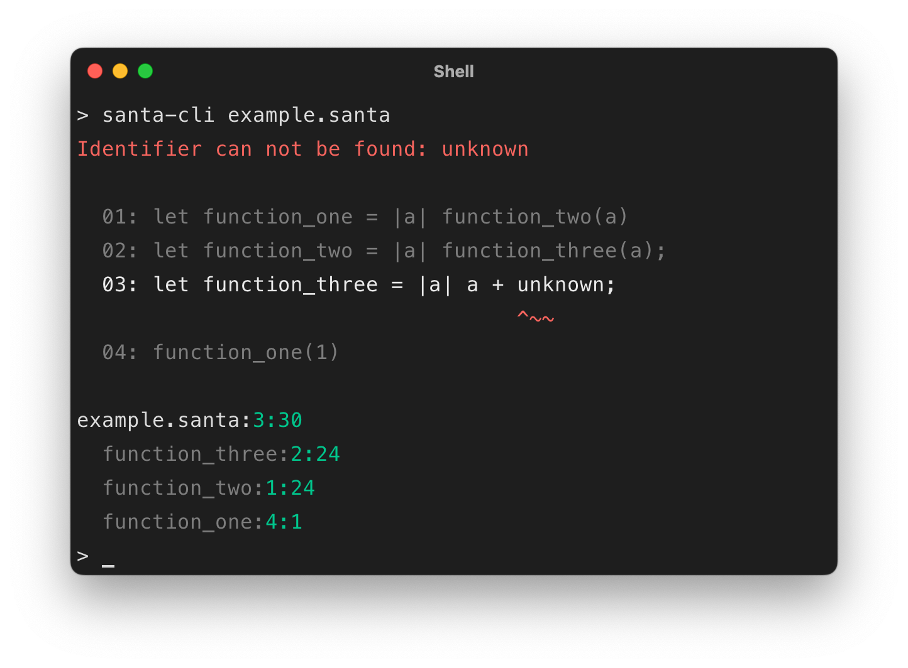
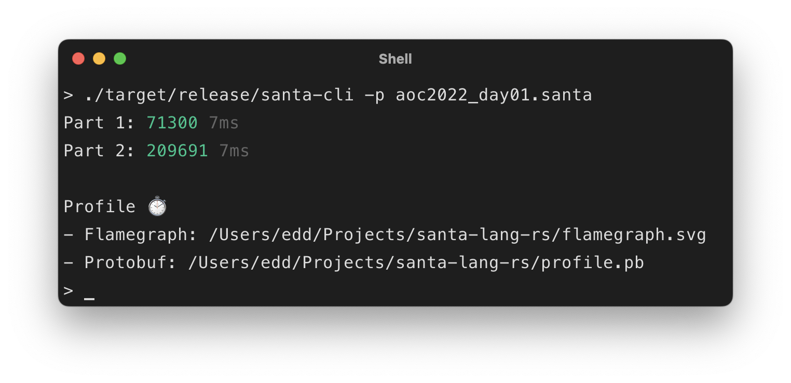
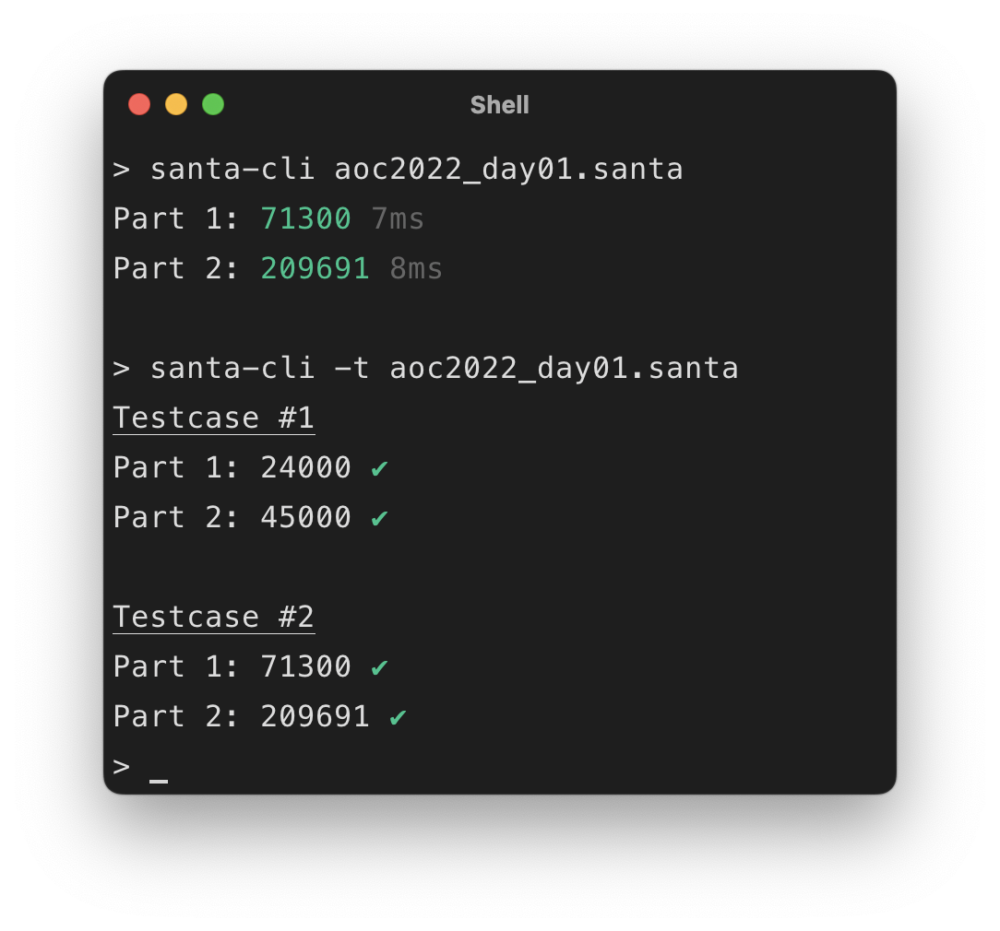
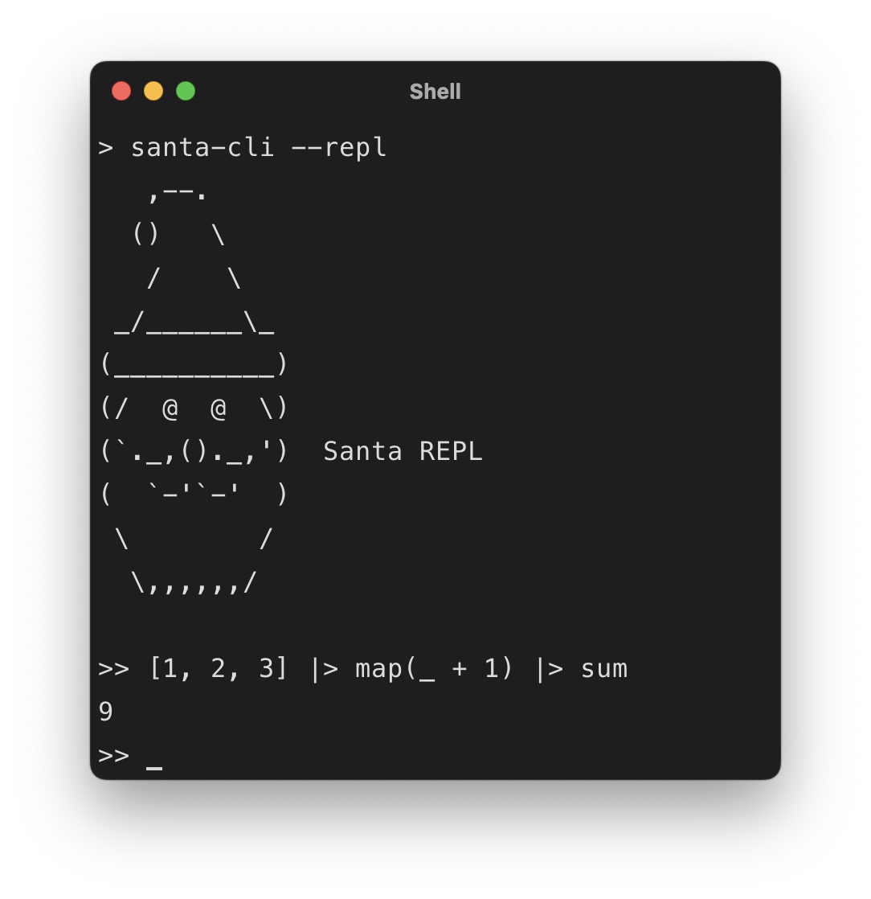

# CLI

[](reindeer/comet.md) [](reindeer/blitzen.md) [](reindeer/dasher.md) [](reindeer/donner.md) [](reindeer/prancer.md)

This runtime provides the ability to access the language/runner via a Command Line Interface (CLI).
It includes the following functionality:

- Execute a given solution's source file, providing benchmark timing for each defined part.
- Execute a given solutions source files test suite.
- Execute a given script source file.
- Load an interactive REPL environment, which can be used to quickly explore the language (Comet, Blitzen, Prancer).

## Release (Comet)

| Platform      | Release                                                                                                                                                |
| ------------- | ------------------------------------------------------------------------------------------------------------------------------------------------------ |
| Linux (x64)   | [`santa-lang-comet-cli-1.0.0-linux-amd64`](https://github.com/eddmann/santa-lang-comet/releases/download/1.0.0/santa-lang-comet-cli-1.0.0-linux-amd64) |
| Linux (ARM)   | [`santa-lang-comet-cli-1.0.0-linux-arm64`](https://github.com/eddmann/santa-lang-comet/releases/download/1.0.0/santa-lang-comet-cli-1.0.0-linux-arm64) |
| macOS (Intel) | [`santa-lang-comet-cli-1.0.0-macos-amd64`](https://github.com/eddmann/santa-lang-comet/releases/download/1.0.0/santa-lang-comet-cli-1.0.0-macos-amd64) |
| macOS (ARM)   | [`santa-lang-comet-cli-1.0.0-macos-arm64`](https://github.com/eddmann/santa-lang-comet/releases/download/1.0.0/santa-lang-comet-cli-1.0.0-macos-arm64) |
| Docker        | [`ghcr.io/eddmann/santa-lang-cli:latest`](https://github.com/eddmann/santa-lang-comet/pkgs/container/santa-lang-cli)                                   |

**Also available in:** [Blitzen](reindeer/blitzen.md), [Dasher](reindeer/dasher.md), [Donner](reindeer/donner.md), [Prancer](reindeer/prancer.md)

> The macOS release may require you to remove the _quarantine_ flag from the executable: `xattr -d com.apple.quarantine santa-lang-comet-cli-*`

## External Functions

The CLI provides three runtime specific functions, these are:

### puts

```
puts(..value)
```

Prints the supplied values (using their display format) to _stdout_.

```
puts("Hello", [1, 2.5, true])
```

### read

```
read(path)
```

Reads the contents of the given path into a String.
The path can either be:

- A local directory path, absolute or relative to the source file.
- Based on a `http(s)` schema being defined; a web URL location.
- Based on a `aoc` schema being defined; a specific Advent of Code problem input (i.e. `aoc://2015/1`).
  In this case an external `SANTA_CLI_SESSION_TOKEN` environment variable must be defined which includes a valid Advent of Code session token.
  This can be extracted from the cookie set upon successful login to the [platform](https://adventofcode.com/).

=== "Local"

    ```
    read("input.txt")
    ```

=== "URL"

    ```
    read("https://www.example.com/input.txt")
    ```

=== "AoC"

    ```
    read("aoc://2015/1")
    ```

### env

```
env()
```

(REPL only) Prints the current environment's variables

## Formatting

[](reindeer/comet.md)

The CLI provides an opinionated code formatter that produces consistent, readable output. There are no configuration options - it enforces a single canonical style.

```bash
# Format to stdout
santa-cli -f solution.santa

# Format file in place
santa-cli --fmt-write solution.santa

# Check if formatted (exit 1 if not, useful for CI)
santa-cli --fmt-check solution.santa
```

The formatter also accepts input from stdin or inline expressions:

```bash
# Format from stdin
echo "let x=1+2" | santa-cli -f

# Format inline expression
santa-cli -e "let x=1+2" -f
```

See the [Formatter](formatter.md) documentation for details on formatting rules.

## Output Formats

The CLI supports three output formats:

| Format | Flag       | Description                                  |
| ------ | ---------- | -------------------------------------------- |
| Text   | (default)  | Human-readable output with ANSI colors       |
| JSON   | `-o json`  | Single JSON object after execution completes |
| JSONL  | `-o jsonl` | Real-time streaming with JSON Lines          |

```bash
# Default human-readable output
santa-cli solution.santa

# JSON output (complete object after execution)
santa-cli -o json solution.santa

# JSONL streaming output (real-time updates)
santa-cli -o jsonl solution.santa
```

The JSON and JSONL formats are useful for integration with editors, CI systems, and other tools. JSONL provides real-time progress updates using [RFC 6902 JSON Patch](https://datatracker.ietf.org/doc/html/rfc6902).

### Exit Codes

| Code | Meaning              |
| ---- | -------------------- |
| 0    | Success              |
| 1    | Argument/usage error |
| 2    | Runtime/parse error  |
| 3    | Test failure         |

## Errors

If an error occurrs during execution the the program is immediately halted; with the error message and associated call stack trace presented to the user, as shown below:

<figure markdown>
  { width="500" }
</figure>

## Profiling

Comet's CLI can be built locally (via a Cargo [`profile`](https://github.com/eddmann/santa-lang-comet/blob/main/runtime/cli/Cargo.toml#L26) feature flag) with additional [flamegraph](https://github.com/tikv/pprof-rs#flamegraph)/[pprof](https://github.com/tikv/pprof-rs#use-with-pprof) CPU profiling output for a given solutions' execution.
This can be useful when trying to determine slow areas of a given solution, to improve its overall performance.

<figure markdown>
  { width="500" }
</figure>

## Example

Below is example output for a successful Advent of Code solution and test execution, using the AoC runner:

<figure markdown>
  { width="400" }
</figure>

Below is example usage of the in-built CLI REPL environment:

<figure markdown>
  { width="400" }
</figure>
