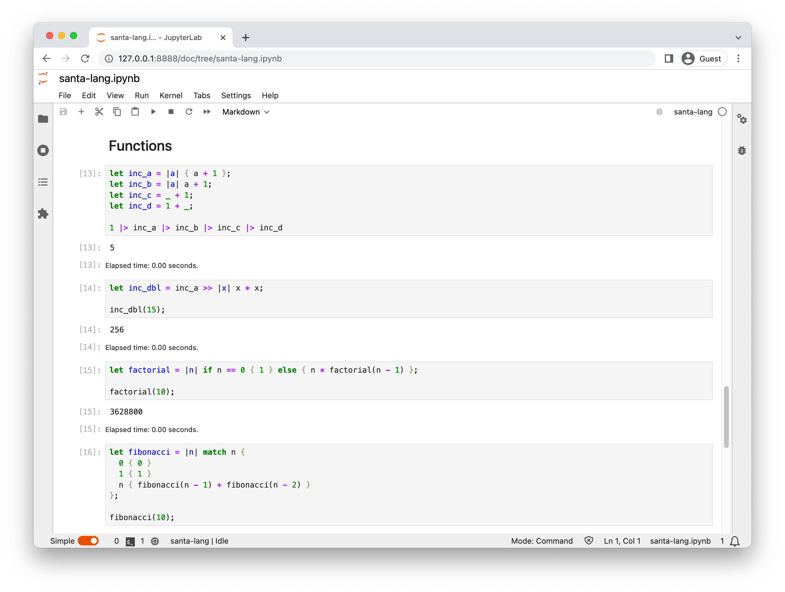

# Jupyter Kernel

This runtime exposes the language as a [kernel](https://docs.jupyter.org/en/latest/projects/kernels.html) which can be used within a [Jupyter Notebook](https://jupyter.org/).
Evaluation of the language (and built-ins) is exposed at this time, the AoC Runner is currently not present.

Similar to other kernels (i.e. [IPython](https://ipykernel.readthedocs.io/en/stable/)), the notebook uses a shared _variable environment_ across all the evaluated code blocks.
This allows you to define variables within one block and access them in subsequently evaluated blocks.

## Release (Comet)

The kernel is released as a standalone platform binary, which can be installed automatically with the host Jupyter Notebook instance by running `./santa-lang-comet-jupyter-* install`.

| Platform      | Release                                                                                                                                                     |
| ------------- | ----------------------------------------------------------------------------------------------------------------------------------------------------------- |
| Linux (x64)   | [`santa-lang-comet-jupyter-0.0.9-linux-amd64`](https://github.com/eddmann/santa-lang-rs/releases/download/0.0.9/santa-lang-comet-jupyter-0.0.9-linux-amd64) |
| macOS (Intel) | [`santa-lang-comet-jupyter-0.0.9-macos-amd64`](https://github.com/eddmann/santa-lang-rs/releases/download/0.0.9/santa-lang-comet-jupyter-0.0.9-macos-amd64) |

## Docker

In addition to the above binaries, a [Dockerfile](https://github.com/eddmann/santa-lang-rs/blob/main/runtime/jupyter/build.Dockerfile) is provided alongside the source to run a containerized JupyterLab instance locally with the kernel pre-installed.
This eases the process of getting up and running with the Notebook environment.

<figure markdown>
  { width="650" }
</figure>

## External Functions

There are currently no external functions (i.e. `read`, `puts`) which are registered with the runtime.
