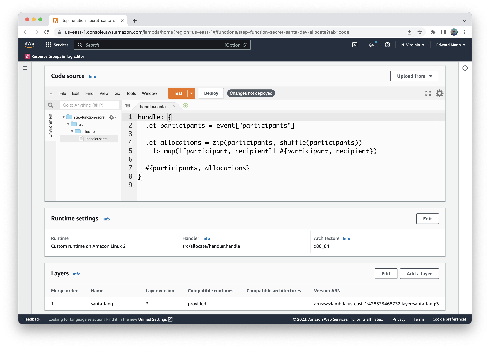
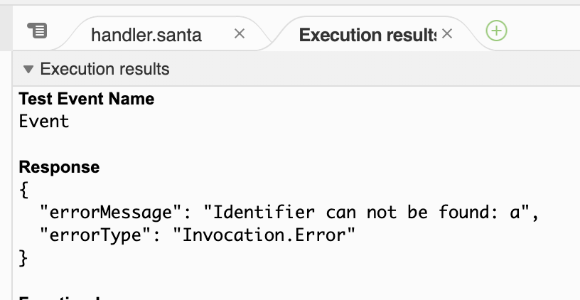

# Lambda

[](https://github.com/eddmann/santa-lang-rs/tree/main/runtime/lambda) [](https://github.com/eddmann/santa-lang-ts/tree/main/src/lambda)

As an exploration into AWS Lambda and how [custom runtimes](https://docs.aws.amazon.com/lambda/latest/dg/runtimes-api.html) are built, I decided to provide access to the core language via the [AWS Lambda](https://aws.amazon.com/lambda/) platform.
This runtime provides the user with the ability to handle a given Lambda request using behaviour defined in santa-lang.
Both the Rust and TypeScript implementation have a Lambda runtime available.
This does not expose the Advent of Code runner, and is only primarily concerned with exposing the core language functionality.

## Release

| Platform     | Release                                                     |
| ------------ | ----------------------------------------------------------- |
| provided.al2 | `arn:aws:lambda:eu-west-1:428533468732:layer:santa-lang:11` |

**Note:** the TypeScript implementation can be accessed via the [GitHub repository](https://github.com/eddmann/santa-lang-ts).

## Lifecycle

Both the Lambda request _event_ and _context_ are supplied to the handler [section](language.md#sections) expression in the form of variables, `event` and `context` accordingly.
The Lambda runtime request/response is implicitly mapped to the languages type system.
The handler itself, is resolved based on the filename and section expression label you wish to invoke.
For example, `fibonacci.handle` would be resolved to the source file `fibonacci.santa`, and within there the defined `handle` section.
The resolved handler is then tasked with performing the desired behaviour, and returning either a _String_ or structured _Dictionary_ result (dependent on the desired Lambda integration).

In a similar manor to other Lambda runtimes (i.e. Node), the handler section is the the only part that is evaluated upon each request.
Other computation put outside this is shared between requests, hence, any expensive work you wish to carry out up front upon cold start can be placed here.
However, mutation should not be relied upon due to the un-determinate nature of when a warm/cold Lambda will be used.

<figure markdown>
  { width="600" }
</figure>

## External Functions

The Lambda runtime provides two specific functions, these are:

### puts

```
puts(..value)
```

Prints the supplied values (using their display format) to _stdout_.

```
puts("Hello", [1, 2.5, true])
```

### read

```
read(path)
```

Reads the contents of the given path into a String.
The path can either be:

- A local directory path, absolute or relative to the source file (within the packaged Lambda artifact).
- Based on a `http(s)` schema being defined; a web URL location.

=== "Local"

    ```
    read("input.txt")
    ```

=== "URL"

    ```
    read("https://www.example.com/input.txt")
    ```

## Errors

The Lambda runtime follows the error response format laid out in the [API specification](https://docs.aws.amazon.com/lambda/latest/dg/runtimes-api.html).

| Type                         | Reason                                                                        |
| ---------------------------- | ----------------------------------------------------------------------------- |
| Runtime.HandlerNotFound      | Handler source file/section is not found                                      |
| Runtime.InitialisationFailed | Unable to parse/evaluate the source file to retrieve the handler section      |
| Runtime.EnvNotFound          | Required enviornment variable (`_HANDLER`, `LAMBDA_TASK_ROOT`) is not present |
| Invocation.Error             | An error occurred during execution of the handler within a Lambda request     |

<figure markdown>
  { width="400" }
</figure>

## Example

Below is an example which documents the use of a handler (with shared function):

```
let fibonacci = |n| {
  let recur = |x, y, n| {
    if n > 0 { return recur(y, x + y, n - 1) } else { x }
  };
  recur(0, 1, n);
};

handle: {
  let number = event["number"];
  puts("Requested the " + number + " number in the fibonacci sequence");
  #{"result": fibonacci(number)};
}
```
